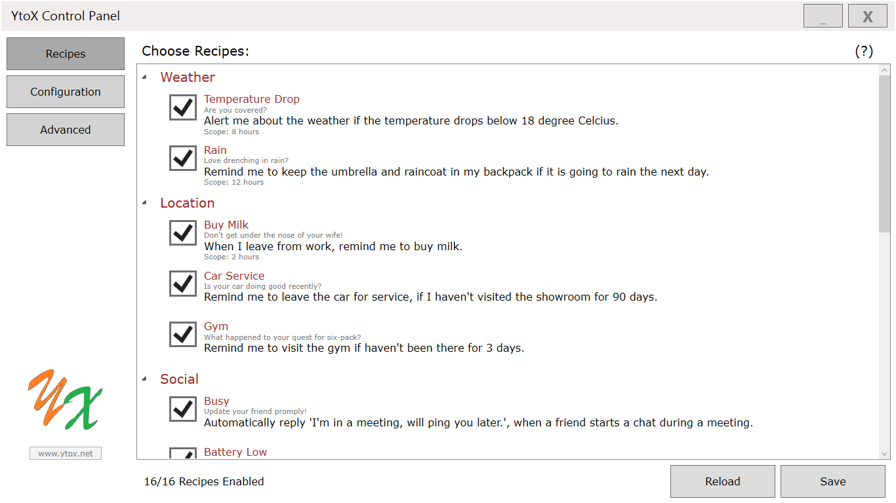
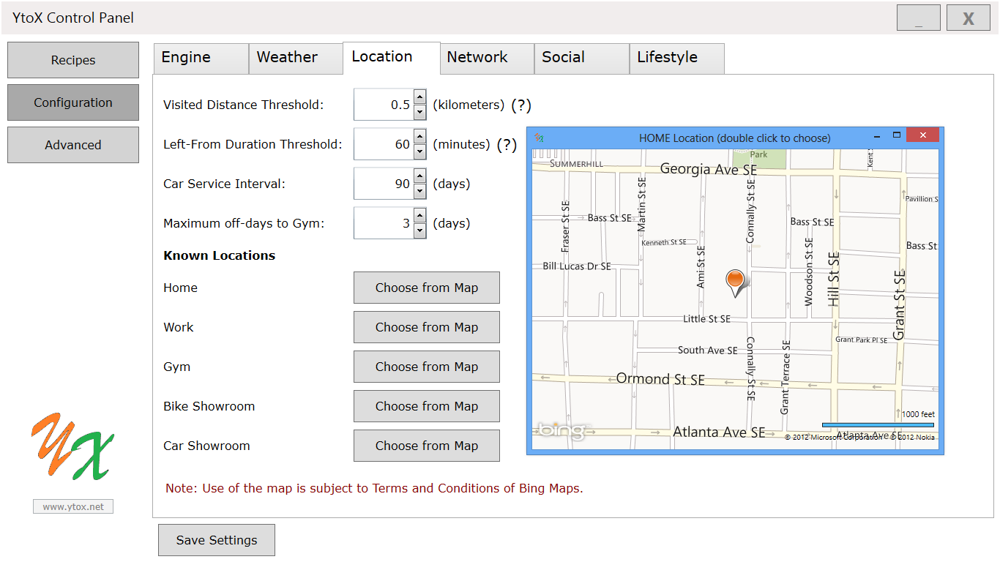
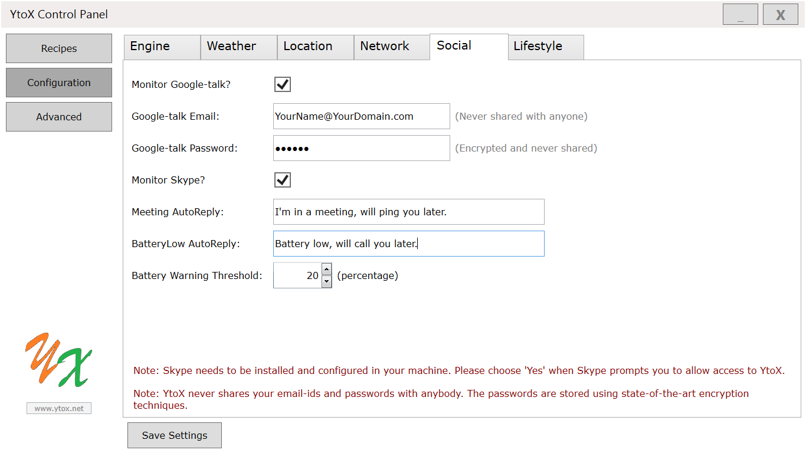
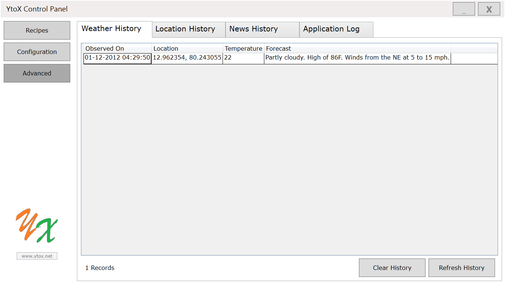

# Introduction

YtoX is an award-winning idea submitted to Intel's Ultrabook App Challenge 2012. YtoX lets you control and extend the capabilities of your Ultrabook™ using interesting recipes. You can customize the recipes to do interesting things for you, to make your personal and work life easier.

> This is not an actively maintained repository. This project is posted here as a backup and as a reference to my portfolio of accomplished projects. The original source submitted to the contest is posted here as is. The last known tested platform is Windows 7 running on Intel(R) Ultrabook(R) with Intel i7 processor.

# What is YtoX

Whether it is a weekday or weekend, imagine a life with your Ultrabook™ always 'on' your desk or your backpack. YtoX enables your Ultrabook to understand you and assist in your daily tasks.

Whether it is buying grocery for your family while going home or sending a weekly summary report to your manager, you don't want to forget such things to the most important people in your life. YtoX will remind you about such things based on your location and time of the day.

Not only the location and time, YtoX leverages other worldly parameters (like weather, latest news) and technical features of your Ultrabook™ (like GPS, accelerometer) to allow better use of the device.

Some of the interesting recipes of YtoX are:

* Remind me to visit the gym, if I haven't been there for 3 days.
* Automatically reply I'm in a meeting, will call you back!, when a friend starts a chat during a meeting.
* Email me all latest news about Windows Phone and XBOX Live.
* Launch Music when I shake the device.
* If I have been to work today, remind me to fill the TimeSheet before I leave for the day.
* Remind me to keep the umbrella & raincoat in my backpack, if it is going to rain the next day.
* Automatically reply Battery low, will call you back!, when someone pings me in Skype when battery is low.
* Show all my friends & family, when I rotate the device.
* Copy all my new or modified PowerPoint presentations to my Dropbox.

YtoX quietly installs and sits in your Ultrabook™ and does all these interesting things without slowing down your computer. In fact, YtoX won't consume too much battery or computation power or internet of your device. It even stops gracefully when battery is critically low, and resumes the operation when power is connected.

With YtoX installed, you will get a feeling of someone intelligent residing inside your PC to make your life easier!

YtoX was originally published in [Intel AppUp® center](http://www.appup.com/app-details/ytox). But since Intel have officially closed the AppUp® center, the original idea and the prototype software submitted to the contest are available [here](Documents/YtoX-CodeProject.pdf).

# More YtoX Recipes

Following list of recipes are available in addition to key ones listed above.

## Weather

* Alert me about the weather if the temperature drops below 20 degree Celcius.
* Remind me to keep the umbrella & raincoat in my backpack, if it is going to rain the next day.

## Location

* When I leave from work, remind me to buy milk.
* Remind me to leave the car for service, if I haven't visited the showroom for 3 months.
* Remind me to visit the gym if haven't been there for 3 days.
* Post the location to Facebook when I'm in my favorite restaurant for more than 20 minutes. *
* Notify me if I'm not traveling in one of my usual routes. *
* When I enter Newark Airport, message my boss about my arrival via Facebook. *
* When I leave Eiffel Tower, upload today's photos from MyPictures folder to my Flickr. *
* When I enter Taj Mahal, tweet about my location. *

## Network

* Email me all latest news about Windows Phone and XBOX Live.
* Email me all latest news related to Steve Ballmer and Steven Sinofsky.
* Open Google if I draw 'S' gesture on the screen. *

## Social

* Automatically reply I'm in a meeting, will call you back!, when a friend starts a chat during a meeting.
* Automatically reply Battery low, will call you back!, when someone pings me in Skype when battery is low.

## Lifestyle

* Remind me of my next appointment if I use my PC after 10pm.
* Mute the volume when a meeting starts, and revert back when the meeting ends.
* If I have been to work today, remind me to fill the TimeSheet before I leave for the day.
* If I have been to work today, remind me to send weekly summary report to my manager, before the weekend fun begins.
* Launch Music when I shake the device.
* Show all my friends & family, when I rotate the device.
* Copy all my new or modified PowerPoint presentations to my Dropbox.
* Start playback when I connect a wired headset. *
* Show my horoscope prediction everyday at 10am. *
* Adjust the screen brightness based on ambient light in the room. *

** Marked recipes are not available yet in current version of source code posted here.

# Usage Disclaimer

YtoX is a free non-commercial application. All the personal information collected by YtoX (like your location, your email-ids, passwords, your appointments & meetings, documents from My Documents folder) are used only for the execution of recipes. The personal details are never displayed publicly and/or never shared with anyone. The passwords are stored using state-of-the-art encryption techniques.

YtoX remains transparent in using the news entries fetched from the RSS links of various news-providers. The emails sent by YtoX contain only the provider-name, news-URL and search-terms used to filter the news. YtoX stores only the title and URL of matched news entries. These saved entries are used only to check whether same news-alert-email was already sent to the user. These saved entries are not shared or used for any other purpose. Apart from these, use of the news alert feature of YtoX and thereby these RSS links are subject to the Terms & Conditions of respective news-providers.

# Data Sources

### Weather

* YtoX fetches weather-information from Wunderground.
* Use of weather-details is subject to the Terms & Conditions of Wunderground.

### Location

* Use of the maps feature is subject to Terms & Conditions of Bing Maps.
* Locations of user are never shared with anyone.

### Network

* YtoX remains transparent in using the news entries fetched from the RSS links of various News Providers. The emails sent by YtoX contain only the provider-name, news-URL and search-terms used to filter the news.
* YtoX stores only the title and URL of matched news entries. These saved entries are used only to check whether same news-alert-email was already sent to the user. These saved entries are not shared or used for any other purpose.
* Apart from these, use of these RSS links is subject to the Terms & Conditions of respective news-providers.

The following news-providers’ RSS links are used to fetch news-articles: 1) Microsoft Top Stories, 2) Google Technology, 3) Yahoo Technology, 4) BBC Technology.

### Social

* Skype needs to be installed and configured in your machine. Please choose Yes when Skype prompts you to allow access to YtoX.
* YtoX never shares your email-ids and passwords with anybody. The passwords are stored using state-of-the-art encryption techniques.

### Lifestyle

* Outlook needs to be installed and configured in your machine. Appointments and Meetings information are fetched from Outlook.
* Use of Dropbox based recipes are at your own risk. If these recipes are enabled, YtoX may automatically copy the documents from your My Documents folder to your Dropbox.

### Scope of a recipe

Scope of a recipe defines minimum duration between successive notifications. For example, the scope of ‘Temperature Drop’ recipe is 8 hours, which means the next temperature-drop notification will be shown only after 8 hours of first notification.
Scope of the recipes are shown in the ‘Recipes’ window, but modifying them is not available in this version of YtoX.

‘TimeSheet’ and ‘Weekly Summary’ recipe assumes you have been to work today, if you have visited your ‘Work’ location atleast once in last 8 hours. Modifying this value is not possible in this version of YtoX.

# Screenshots

Some of the screenshots from Windows 7 on Intel(R) Ultrabook(TM) are shared here:

### Choose Recipes

### Location Recipes Configuration

### Social Recipes Configuration

### Advanced Tab - Weather History

# Terms of Use

Use of YtoX is at the sole risk of end users. The creators or publishers of YtoX will not be responsible for any type of side effect or damage resulted in the installation or use of YtoX.
